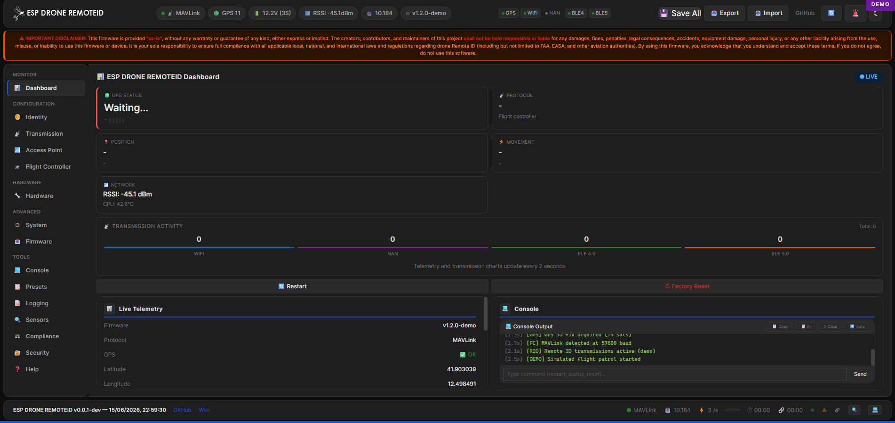

<p align="center">
  
</p>

<p align="center">
  <a href="https://github.com/VOLTEKOVER/ESP_DRONE_REMOTEID/actions/workflows/build.yml"></a>
  <a href="https://VOLTEKOVER.github.io/ESP_DRONE_REMOTEID/"></a>
  <a href="https://github.com/VOLTEKOVER/ESP_DRONE_REMOTEID/releases"></a>
  <a href="https://www.espressif.com/"></a>
  <a href="LICENSE"></a>
</p>

<p align="center">
  &nbsp;&nbsp;
  &nbsp;&nbsp;
  
</p>

<p align="center">
  <b>ASTM F3411-22a / ASD-STAN prEN 4709-002</b> Open DroneID transmitter.<br>
  Parses <b>MAVLink &middot; MSP &middot; NMEA &middot; DroneCAN</b> from any flight controller.<br>
  Broadcasts via <b>WiFi Beacon + NAN + BLE 4.0/5.0</b> with Kalman filter, Ed25519 auth, SHA-256 OTA verification, and security hardening.
</p>

<p align="center">
  <b>Vendored Dependencies</b><br>
  <a href="https://github.com/mavlink/c_library_v2"><code>MAVLink c_library_v2</code></a> Jul 2026 &middot;
  <a href="https://github.com/opendroneid/core-c"><code>OpenDroneID core-c</code></a> Protocol v2 &middot;
  <a href="https://components.espressif.com/components/espressif/cjson"><code>cJSON</code></a> ^1.7.19 &middot;
  <a href="https://github.com/espressif/esp-idf"><code>ESP-IDF</code></a> v6.0.1
</p>

<p align="center">
  Supports: <b>ESP32, ESP32-S3, ESP32-C6</b> &nbsp;·&nbsp; Includes: <b>RID Hub</b> ground station (Electron/React, no Python)
</p>

<p align="center">
  <a href="https://VOLTEKOVER.github.io/ESP_DRONE_REMOTEID/"><b>📖 Wiki & Demo</b></a>&nbsp;&nbsp;
  <a href="https://VOLTEKOVER.github.io/ESP_DRONE_REMOTEID/config(demo).html"><b>🎮 Live Demo</b></a>
</p>

---

> [!CAUTION]
> ## ⚠️ NO RELEASE UNTIL SECURITY AUDIT IS COMPLETE
>
> **This firmware has NOT been security tested yet.**
> No official release will be published until a full security audit
> (penetration testing, firmware analysis, protocol fuzzing) has been
> performed and all critical/high findings are resolved.
>
> **Do NOT use this in production aircraft.**
> Use only for development and testing on the ground.
>
> See [SECURITY.md](SECURITY.md) for details.

---

## Table of Contents

1. [Quick Start](#-quick-start)
2. [Features](#-features)
3. [Communication Overview](#-communication-overview)
4. [Hardware](#-hardware)
5. [Build](#️-build)
6. [Project Structure](#-project-structure)
7. [Development Status](#-development-status)
8. [Testing](#-testing)
9. [Documentation](#-documentation)
10. [Security Notes](#-security-notes)
11. [Contributing](#-contributing)
12. [License & Ecosystem](#-license)
13. [Next Steps](#-next-steps)

---

## ⚡ Quick Start

> 🎯 No hardware yet? Try the **[offline demo](https://VOLTEKOVER.github.io/ESP_DRONE_REMOTEID/config(demo).html)** first — full simulation, no ESP32 required.

| Step | Action |
|:---:|---|
| 1 | Connect ESP32 to USB |
| 2 | Open [VOLTEKOVER.github.io/ESP_DRONE_REMOTEID](https://VOLTEKOVER.github.io/ESP_DRONE_REMOTEID/) |
| 3 | Select your chip (**ESP32** / **ESP32-S3** / **ESP32-C6**) |
| 4 | Click **Install**, pick serial port |
| 5 | Connect to WiFi **ESP-RID** |
| 6 | Open `http://192.168.4.1` to configure |

---

## 🎯 Features

### Radio & Protocols

| Feature | Details |
|---|---|
| **Broadcast** | WiFi Beacon (802.11 mgmt) + WiFi NAN + BLE 4.0 Legacy + BLE 5.0 Long Range (dual instances, S3/C6) |
| **Input protocols** | MAVLink v2 (ArduPilot/PX4), MSP (Betaflight/iNAV), NMEA, DroneCAN/CAN bus — auto-detect |
| **GPS source** | From flight controller (MAVLink/MSP/NMEA/CAN) **or** direct GPS module, takeoff location capture |
| **Position filter** | 1D×3 Kalman (lat/lon/alt) with velocity prediction, 3s timeout |

### Security & Compliance

| Feature | Details |
|---|---|
| **Authentication** | Ed25519 signing (ASTM F3411-22a compliant), 4 pages per broadcast cycle |
| **Lock levels** | 3-tier: Normal / Ed25519 signed / eFuse permanent |
| **OTA updates** | WiFi AP with client-side SHA-256 (Web Crypto) + Ed25519 signature verification |
| **Security hardening** | cJSON parser, rate limiting (10 fails/60s), strncpy null-term, `psa_crypto_init()` |
| **Shared security** | `rid_security.c/h` module: SHA-256, Ed25519, hex utilities |
| **Configuration** | 70+ parameters: UAS ID, rates, power, public keys, auth, lock, lighting |

### User Interface

| Feature | Details |
|---|---|
| **Web UI** | Built-in WiFi AP at `192.168.4.1` + REST API + live telemetry |
| **CLI** | Raw UART REPL (14 commands: status, config, restart, patrol, transmit, etc.) |
| **Storage** | Persistent NVS configuration, eFuse tamper detection |
| **Dashboard** | Dark/light mode, responsive (mobile/tablet/desktop) |

<p align="center">
  
</p>

### Hardware & Lighting

| Feature | Details |
|---|---|
| **Status LED** | RGB PWM (LEDC) with 7 states + TX flash (configurable GPIO) |
| **Addressable LED** | WS2812 RGB (RMT driver) with HSV/RGB + brightness control |
| **GPIO Lighting** | 5-channel pattern outputs (OFF/SOLID/BLINK_SLOW/BLINK_FAST/ARMED/GPS_FLASH) with phase offsets |
| **Demo mode** | Simulated GPS patrol (Rome Colosseum, 200m radius, 6 m/s) |

### Ground Station (RID Hub)

| Component | Stack |
|---|---|
| **Decoder** | Pure JavaScript, ASTM F3411-22a parser |
| **Tracker** | Device tracking with 500-point trail, CSV/KML export |
| **Capture** | WiFi monitor mode + BLE scan + Serial USB (optional npm modules) |
| **UI** | React 19 + Ant Design 6 + Vite 8 + Leaflet |

---

## 📡 Communication Overview

### Input (GPS from Flight Controller)

| Protocol | Format | Details |
|---|---|---|
| **MAVLink v2** | ArduPilot/PX4 | `GPS_RAW_INT`, `GLOBAL_POSITION_INT`, `HEARTBEAT`, `OPEN_DRONE_ID_*` |
| **MSP** | Betaflight/iNAV | `MSP_RAW_GPS` (106), `MSP_ATTITUDE` (108), `MSP_STATUS` (101) |
| **NMEA 0183** | Direct GPS module | `$GPGGA`, `$GNGGA`, `$GPRMC`, `$GNRMC`, `$GPVTG`, `$GNVTG` |
| **DroneCAN** | CAN bus | `uavcan.equipment.gnss.Fix2` (TWAI decode) |

### Output (RID Broadcast)

| Medium | Standard | Range |
|---|---|---|
| **WiFi Beacon** | IEEE 802.11 Mgmt | ~100 m (typical) |
| **WiFi NAN** | Service Discovery | ~100 m |
| **BLE 4.0** | Legacy advertising | ~50 m |
| **BLE 5.0** | Coded PHY (S3/C6) | ~200+ m (LR mode) |

### Configuration & Control

| Channel | Type | Access |
|---|---|---|
| **Web UI** | HTTP REST API | `192.168.4.1` (AP mode) |
| **CLI** | UART REPL | UART0 @ 115200 baud |
| **NVS** | Flash storage | Persistent config |
| **GPIO** | Lighting outputs | 5 configurable channels |

---

## 🔧 Hardware

### Minimum Wiring (ESP32 + Flight Controller)

```
Flight Controller    ESP32 (or variant)
─────────────────    ─────────────────
TX (UART)       →    GPIO16 (UART2 RX)
GND             →    GND
5V (BEC)        →    5V / VIN
```

> ⚠️ **NMEA tap**: add a **1 kΩ series resistor** on the tap line to prevent backfeed.

### Recommended: Seeed XIAO ESP32-C6 (Zero-solder Kit)

| Feature | Benefit |
|---|---|
| **21 × 17.8 mm** | Fits in any enclosure |
| **USB-C + LiPo charger** | Battery-ready, no soldering |
| **WiFi 6 + BT 5.3** | Better range & throughput |
| **802.15.4 capable** | Future mesh support |
| **U.FL + ceramic antenna** | Switchable antenna, multi-band |
| **Stackable with L76K GNSS** | Direct GPS module option |
| **~$15 total cost** | Best value |

📋 Full BOM & pinout: [`docs/prototype_bom.md`](docs/prototype_bom.md)

---

## 🛠️ Build

### Online (No Toolchain)

Push to `main` → automatic build for all 3 targets via GitHub Actions.
👉 [Latest builds](https://github.com/VOLTEKOVER/ESP_DRONE_REMOTEID/actions/workflows/build.yml)

### Local Build (ESP-IDF v6.0.1+)

```bash
git clone https://github.com/VOLTEKOVER/ESP_DRONE_REMOTEID.git
cd ESP_DRONE_REMOTEID

idf.py set-target esp32       # or esp32s3 / esp32c6
idf.py build
idf.py flash monitor          # Flash & open serial monitor
```

---

## 📁 Project Structure

```
ESP_DRONE_REMOTEID/
├── ESP32_DRONE_REMOTE_ID_Firmware/     # ESP-IDF firmware (C, 94% of repo)
│   ├── main/app_main.c                 # Entry point
│   └── components/esp_remote_id/
│       ├── src/                        # 28 source files
│       │   ├── esp_remote_id.c         # Main orchestrator (543 L)
│       │   ├── mavlink_parser.c        # Protocol detection + parsing (276 L)
│       │   ├── web_config.c            # HTTP server + REST API (735 L)
│       │   ├── wifi_tx.c               # WiFi beacon/NAN TX (204 L)
│       │   ├── ble_tx.c                # BLE 4.0/5.0 TX (198 L)
│       │   ├── rid_kalman.c            # 1D×3 Kalman filter (146 L)
│       │   ├── rid_auth.c              # Ed25519 signing (107 L)
│       │   ├── rid_ota.c               # OTA update server (SHA-256 + Ed25519)
│       │   ├── rid_security.c          # Shared verification module (SHA-256, Ed25519, hex)
│       │   ├── rid_dronecan.c          # DroneCAN CAN bus (142 L)
│       │   ├── led_ws2812.c            # WS2812 addressable RGB (110 L)
│       │   ├── rid_lighting.c          # GPIO lighting (101 L)
│       │   ├── rid_mavlink_usb.c       # MAVLink USB CDC transport (42 L)
│       │   ├── rid_mavlink_tx.c        # MAVLink telemetry TX (59 L)
│       │   ├── rid_patrol.c            # Demo GPS patrol (31 L)
│       │   ├── cli.c                   # UART CLI REPL (317 L)
│       │   └── ...                     # 12 more parsers/utilities
│       ├── include/                    # 24 public headers
│       ├── webui/config.html           # Embedded web UI (~1520 L inline)
│       └── mavlink/                    # MAVLink v2 dialect headers
│   ├── partitions.csv                  # OTA partition layout (4 MB)
│   └── sdkconfig.defaults              # ESP-IDF config baseline
│
├── RID_Hub/                            # Ground station (Electron)
│   ├── main.js                         # Electron main process (IPC)
│   ├── preload.js                      # contextBridge for renderer
│   ├── src/
│   │   ├── decoder.js                  # ASTM F3411-22a decoder
│   │   ├── tracker.js                  # Device tracking + CSV/KML
│   │   └── capture.js                  # WiFi/BLE/Serial capture
│   ├── renderer/src/
│   │   ├── App.tsx                     # Ant Design layout
│   │   ├── components/
│   │   │   ├── DashboardTab.tsx        # Statistics + recording
│   │   │   ├── DevicesTab.tsx          # Device table
│   │   │   ├── MapTab.tsx              # Leaflet map
│   │   │   ├── TimelineTab.tsx         # RSSI chart + log
│   │   │   └── CaptureTab.tsx          # Capture controls
│   │   └── hooks/useRidApi.ts          # IPC bridge
│   ├── package.json                    # React 19 + Ant Design 6 + Vite 8
│   └── vite.config.ts
│
├── docs/                                # GitHub Pages
│   ├── index.html                       # Landing + WebSerial installer (~969 L)
│   ├── guide.html                        # Technical wiki (sections 3–16, ~2066 L)
│   ├── config(demo).html                 # Offline config UI demo (~2546 L)
│   ├── manifest.json                     # ESP Web Tools firmware manifest
│   ├── prototype_bom.md                  # Hardware BOM + wiring
│   └── images/                           # Logos + assets
│
├── todolist/softwarestatus.md          # Complete software inventory
├── .github/workflows/
│   ├── build.yml                       # CI: 3-target matrix + Pages deploy
│   ├── release.yml                     # GitHub Release + auto-changelog
│   ├── codeql.yml                      # CodeQL security analysis
│   ├── deploy-pages.yml                # Manual Pages deployment
│   ├── rid-hub-ci.yml                 # RID Hub build + test
│   └── dependabot.yml
├── LICENSE                             # Apache 2.0
└── README.md                           # This file
```

---

## 📊 Development Status

### ✅ Completed (v1.0.0-beta, 2026-07-26)

- Kalman position predictor (1D×3 with velocity)
- Ed25519 authentication (ASTM F3411-22a compliant)
- OTA update with SHA-256 + Ed25519 signature verification
- Client-side SHA-256 hash (Web Crypto API) + `X-Expected-SHA256` header
- WiFi Beacon + NAN + BLE 4.0/5.0 LR (Coded PHY, dual instances)
- MAVLink (+ MESSAGE_PACK, ARM_STATUS, USB serial, 6 ODID submessages)
- MSP, NMEA, DroneCAN input protocols
- cJSON parser (replaces naive `strstr()` — security hardening)
- Rate limiting (10 fails/60s sliding window on signature verification)
- `rid_security.c/h` shared verification module (SHA-256 + Ed25519 + hex utils)
- Takeoff location capture (first 3D fix stored as operator reference)
- WS2812 RGB LED (RMT driver) + GPIO lighting (5-ch)
- Web UI + REST API + CLI (14 commands, 70+ configurable params)
- NVS persistence + 3-tier eFuse lock levels
- Task watchdog (WDT reset in main loop)
- RID Hub ground station (Electron + React 19 + release builds)
- CI green on all 3 targets (ESP32/S3/C6) + individual .bin artifacts
- All 21 ESPsquawk fork fixes ported and verified

📋 Full roadmap: [`todolist/softwarestatus.md`](todolist/softwarestatus.md)

---

## 🧪 Testing

### Firmware Testing

```bash
# Build for ESP32-C6 (recommended)
idf.py set-target esp32c6
idf.py build
idf.py flash monitor
```

CLI commands to try once connected:

```
> status              # Show GPS, TX rates, identity state
> config get uas_id   # Check config
> transmit 10         # Force 10 packets
> patrol              # Start demo GPS patrol
```

### Ground Station (RID Hub)

```bash
cd RID_Hub
npm install
npm run dev        # Start dev server (http://localhost:5173)
npm run build      # Build for production
npm start          # Package + launch Electron
```

### Web UI Demo (No Hardware)

👉 [Live demo](https://VOLTEKOVER.github.io/ESP_DRONE_REMOTEID/config(demo).html) with simulated GPS, battery, counters, logs.

---

## 📚 Documentation

| Resource | Link |
|---|---|
| **Quick Start** | [GitHub Pages](https://VOLTEKOVER.github.io/ESP_DRONE_REMOTEID/) |
| **Technical Wiki** | [sections 1–16: protocols, wiring, API, security](https://VOLTEKOVER.github.io/ESP_DRONE_REMOTEID/guide.html) |
| **Hardware BOM** | [`docs/prototype_bom.md`](docs/prototype_bom.md) |
| **Software Inventory** | [`todolist/softwarestatus.md`](todolist/softwarestatus.md) |
| **API Reference** | Web UI `/api/*` endpoints (documented in guide) |

---

## 🔐 Security Notes

### Authentication (Lock System)

| Level | Name | Behavior |
|---|---|---|
| **0** | Normal | No restrictions, read all config |
| **1** | Ed25519 Signed | Signature-based control for sensitive commands (restart, reset, OTA) |
| **2** | eFuse Permanent | Reads `EFUSE_BLK3` magic; irreversible (chip erase only) |

### OTA Updates

- **Client-side SHA-256** computed via Web Crypto API (`crypto.subtle.digest`)
- **Mandatory `X-Expected-SHA256`** header (hex-encoded SHA-256 of firmware body)
- **Optional `X-Signature`** header (Ed25519 signature when lock level ≥ 1)
- Server-side SHA-256 + Ed25519 verification via `rid_security.c` module
- Rejects mismatched or missing hashes — prevents corrupt or malicious firmware
- Dual-OTA partition scheme with automatic rollback on failure

### Security Hardening

- **cJSON parser** — all web API inputs parsed with cJSON (prevents injection)
- **Rate limiting** — 10 failed signature attempts per 60s sliding window
- **strncpy null-termination** — all string fields explicitly null-terminated
- **`psa_crypto_init()`** — PSA Crypto API initialized at boot for ESP-IDF v5+
- **Shared verification** — `rid_security.c/h` module used by both `web_config.c` and `rid_ota.c`

### Key Storage

- Ed25519 **private key** stored in NVS (encrypted at rest if flash encryption enabled)
- **Public keys** (up to 5) for lock level command authentication
- Consider `CONFIG_SECURE_FLASH_ENC` on production builds

---

## 🤝 Contributing

Contributions welcome! Please:

1. Follow coding style (see `.vscode/settings.json`)
2. Test on at least one target (ESP32 / S3 / C6)
3. Update `todolist/softwarestatus.md` for major changes
4. Create PR with description + hardware test notes

See [`PULL_REQUEST_TEMPLATE.md`](.github/PULL_REQUEST_TEMPLATE.md) for the full checklist.

---

## 📜 License

```
ESP Remote ID — Open DroneID Transmitter for ESP32
Copyright (C) 2024 VOLTEKOVER

Based on Intel Open Drone ID (https://github.com/opendroneid)
Copyright (C) 2019-2023 Intel Corporation

Licensed under the Apache License, Version 2.0.
See LICENSE file for details.
```

### 🌍 Ecosystem

| Project | Purpose | Status |
|---|---|---|
| **opendroneid-core-c** | ASTM F3411 encoder/decoder | ✅ Vendored in repo |
| **ESP-IDF** | ESP32 SDK | ✅ v6.0.1+ |
| **MAVLink v2** | ArduPilot/PX4 protocol | ✅ ardupilotmega dialect |
| **mbedTLS** | Crypto (Ed25519, ECDSA) | ✅ ESP-IDF built-in |
| **RID Hub** | Ground station (Electron) | ✅ Standalone app |

---

## 🚀 Next Steps

1. **Try the demo**: [offline config UI](https://VOLTEKOVER.github.io/ESP_DRONE_REMOTEID/config(demo).html)
2. **Build locally**: clone repo, `idf.py build`, `idf.py flash`
3. **Connect**: WiFi **ESP-RID** → `192.168.4.1`
4. **Check documentation**: [Wiki](https://VOLTEKOVER.github.io/ESP_DRONE_REMOTEID/guide.html)
5. **Report issues**: [GitHub Issues](https://github.com/VOLTEKOVER/ESP_DRONE_REMOTEID/issues)

---

<p align="center">
  Made with ❤️ by <a href="https://github.com/VOLTEKOVER">VOLTEKOVER</a>
</p>
