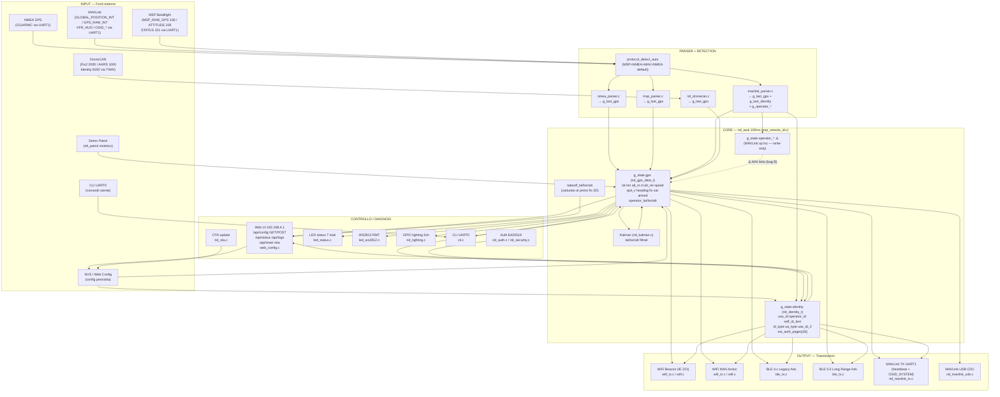

# ESP DRONE REMOTEID — Data Flow / Mega Graph

Last updated: 2026-08-02
Scope: tutti i protocolli, variabili e dati attraversati dal firmware (`components/esp_remote_id/src/*.c`, `main/main.c`).

---

## 🧠 Risposta rapida: condivisione / forwarding drone-drone

**NON ESISTE codice attivo di condivisione o rinvio di connessioni tra droni.**

Cosa c'è (e cosa NON c'è):

| Funzionalità | Stato | Dove |
|---|---|---|
| RX WiFi promiscuo / sniffer (odid RX) | ❌ **Definito ma MAI chiamato** (codice libreria morto) | `wifi.c:520`, `wifi.c:535` |
| RX BLE scanner | ❌ Assente (`esp_ble_gap_start_scanning` mai usato) | `ble_tx.c` è solo TX |
| Relay mesh / ESP-NOW | ❌ Assente (è solo un TODO in roadmap) | `softwarestatus.md` "ESP-NOW mesh relay" |
| Forwarding MAVLink in uscita verso GCS | ⚠️ Solo TX heartbeat + operator location | `rid_mavlink_tx.c:30-60` (UART1) |
| Re-broadcast di RID di altri droni | ❌ Assente | — |

I parser RX (`mavlink_parser`, `msp_parser`, `nmea_parser`, `rid_dronecan`) ricevono dati SOLO dal flight controller via UART/CAN, li consumano e li ritrasmettono come RID **del drone stesso**. Non esiste alcun meccanismo che riceva il RID di un altro drone (WiFi o BLE) e lo ritrasmetta.

---

## 🕸️ Mega Grafo (Mermaid)



---

## 📦 Dati per riga di bus (dettaglio campo per campo)

### 1) NMEA GPS — `nmea_parser.c`

| Sorgente | Funzione | Campo scritto | Struttura di destinazione |
|---|---|---|---|
| `$GPRMC` (r.54-57) | `nmea_to_decimal()` | `latitude`, `longitude` | `g_last_gps` |
| `$GPGGA` (r.69-70) | `nmea_to_decimal()` | `latitude`, `longitude` | `g_last_gps` |
| `$GPGGA` (r.59-60) | `atof()` | `altitude_msl`, `altitude_baro` | `g_last_gps` |
| `$GPGGA` (r.63-67) | — | `fix_type`, `satellites` | `g_last_gps` |
| `nmea_parser_get()` (r.132) | — | copia tutto (gate: fix≥2 && lat≠0) | `gps` → `g_state.gps` |

**Nessun dato operatore da NMEA** — `operator_lat/lon/alt` restano a 0.

### 2) MSP Betaflight — `msp_parser.c`

| Messaggio | Campi scritti |
|---|---|
| `MSP_RAW_GPS (106)` | `fix_type, satellites, latitude, longitude, altitude_msl, altitude_baro, speed, heading` |
| `MSP_ATTITUDE (108)` | `heading` (yaw/10) |
| `MSP_STATUS (101)` | `armed` (flag bit 0) |

Gate in `msp_parser_get()` (r.122): fix≥3 && lat≠0.

### 3) MAVLink — `mavlink_parser.c`

| Msg ID | Campi scritti | Destinazione |
|---|---|---|
| `GLOBAL_POSITION_INT` (r.104) | `lat, lon, alt` | `g_last_gps` |
| `GPS_RAW_INT` (r.119) | `lat, lon, alt` | `g_last_gps` |
| `VFR_HUD` (r.131) | `altitude_msl, speed` | `g_last_gps` |
| `ATTITUDE` / `AHRS2` (r.139/146) | `heading` | `g_last_gps` |
| `HEARTBEAT` (r.153) | `mavlink_armed` | `g_state` (via getter) |
| `OPEN_DRONE_ID_LOCATION` (r.161) | lat/lon/alt/speed/hdg/fix | `g_last_gps` |
| `OPEN_DRONE_ID_BASIC_ID` (r.175) | `uas_id, id_type, ua_type` | `g_last_identity` |
| `OPEN_DRONE_ID_OPERATOR_ID` (r.187) | `operator_id` | `g_last_identity` |
| `OPEN_DRONE_ID_SELF_ID` (r.198) | `self_id_text, self_id_desc_type` | `g_last_identity` |
| `OPEN_DRONE_ID_AUTHENTICATION` (r.210) | `ext_auth_pages[16]` | `g_last_identity` |
| `OPEN_DRONE_ID_SYSTEM` (r.223) | **⚠️ operator lat/lon → `g_last_gps.latitude/longitude` (BUG A)** + `g_operator_*` | `g_last_gps` + `g_operator_*` |
| `OPEN_DRONE_ID_MESSAGE_PACK` (r.235) | decode sub-msg 0..5 → tutto | `g_last_gps` + `g_last_identity` |

### 4) DroneCAN — `rid_dronecan.c`

| CAN ID | Messaggio | Campi scritti |
|---|---|---|
| `2000` | `uavcan.equipment.gnss.Fix2` | `lat, lon, altitude_msl, altitude_relative, speed, heading, fix_type, satellites` |
| `1000` | `uavcan.equipment.ahrs.Solution` | **non decodificato** (stub r.62-65) |
| `8192` | `org.drone_id.Identity` | **non decodificato** (stub r.67-70) |

⚠️ AHRS e Identity sono stub vuoti → la posizione operator via DroneCAN non esiste.

### 5) Demo Patrol — `rid_patrol.c` (r.17-19)

Scrive solo: `altitude_msl/baro/relative` (sinusoidale) + `latitude/longitude` (cerchio). Entra in `g_state.gps` quando `RID_OPT_DEMO_MODE`.

### 6) Assembly Core — `esp_remote_id.c` (rid_task r.399-630)

| Passo | Riga | Azione |
|---|---|---|
| Detect protocollo | 418-421 | `protocol_detect_auto()` o protocollo configurato |
| Read parser | 427-445 | `nmea_parser_get` / `msp_parser_get` / `mavlink_parser_get` / `rid_dronecan_get` |
| Gate GPS | 452 | `force_tx (FORCE_ARM_OK) || fix_type>=2` |
| Copia stato | 455-456 | `g_state.gps = gps_data; gps_valid=true` |
| Identità | 465-482 | MAVLink (se presente) altrimenti da `g_config` |
| Takeoff | 484-490 | primo fix 3D → `takeoff_lat/lon/alt` |
| Operatore | 492-505 | MAVLink → `g_state.operator_*` **⚠️** altrimenti `g_state.gps.operator_* = g_config.operator_*` |
| Identity gate | 514-521 | `RID_OPT_IDENTITY_READY_GATE` |
| Demo | 523-544 | `rid_patrol_tick` + identità da config |
| Kalman | 546-572 | update+predict+overwrite `g_state.gps` |
| Timeout GPS | 574-579 | `gps_valid=false` dopo 10s |
| TX | 581-584 | `update_transmissions()` → WiFi/BLE |

---

## 🐞 BUG TROVATI (sospetto "scambio drone/operatore" → CONFERMATO)

### BUG A — `mavlink_parser.c:226-227` (CRITICO: posizione operatore sovrascrive posizione drone)
```c
g_last_gps.latitude  = odid_sys.operator_latitude  / 1e7;   // ← scrive l'OPERAATORE nella posizione DRONE
g_last_gps.longitude = odid_sys.operator_longitude / 1e7;
```
Quando il flight controller invia un `OPEN_DRONE_ID_SYSTEM` (lo fa ArduPilot per la posizione operatore), il parser copia le coordinate **dell'operatore** nei campi della **posizione del drone**. Visto che r.341 forza `g_last_update` se lat/lon≠0, la posizione trasmessa diventa quella dell'operatore → **è esattamente il sintomo che hai visto**. Fix: rimuovere le due righe (tenere solo `g_operator_*`).

### BUG B — `esp_remote_id.c:496-505` (HIGH: operator location MAVLink mai trasmesso)
- TX legge `g_state.gps.operator_*` → `wifi_tx.c:194-195`, `ble_tx.c:72-73`.
- MAVLink scrive `g_state.operator_*` (r.496-498), che è **write-only** (nessun consumer).
- Quindi la posizione operatore trasmessa è SEMPRE quella statica di `g_config.operator_*` (r.502-504), mai quella ricevuta da MAVLink.
- Fix: dopo r.496-498 copiare anche in `g_state.gps.operator_lat/lon/alt`.

### Nota BLE `System.OperatorAltitudeGeo`
`ble_tx.c`/`wifi_tx.c` impostano `OperatorLatitude/Longitude` ma **mai `OperatorAltitudeGeo`** (resta 0).

---

## 📤 Output — mappa messaggi ODID

| Messaggio ODID | WiFi Beacon | WiFi NAN | BLE4 | BLE5 | MAVLink TX |
|---|---|---|---|---|---|
| BasicID (0) | ✅ `wifi_tx.c:170-180` | ✅ | ✅ `ble_tx.c:42-52` | ✅ | — |
| Location (1) | ✅ `:182-191` | ✅ | ✅ `:54-63` | ✅ | — |
| System (4) | ✅ `:193-197` | ✅ | ✅ `:71-73` | ✅ | ✅ `rid_mavlink_tx.c:53` |
| SelfID (3) | ✅ `:199-203` | ✅ | ✅ `:65-69` | ✅ | — |
| OperatorID (5) | ✅ `:205-206` | ✅ | ✅ `:75-76` | ✅ | — |
| Auth (2) | ⚠️ (da `ext_auth_pages`, se `AUTH_ED25519`) | — | — | — | — |

---

## 🖥️ Web API / Status — campi esposti

`/api/status` (web_config.c:347-369): `fw_version, protocol, gps_valid, lat, lon, alt, speed, heading, satellites, fix_type, tx_total, tx_wifi_bcn, tx_wifi_nan, tx_ble4, tx_ble5, takeoff_captured, takeoff_lat, takeoff_lon, takeoff_alt, uptime_ms`.

`/api/config` GET (r.300-345): tutti i campi di `rid_config_t` (protocol, uart, ua_type, id_type, uas_id, operator_id, tx_modes, wifi_*, ble4_*, ble5_*, operator_lat/lon/alt, options, led_*, ws2812_*, lighting_*, dronecan_*, mavlink_usb_enable, ota_trigger_gpio, auth_private_key, start_delay_ms).

`/api/config` POST: verifica firma `X-Signature` (Ed25519) se `lock_level>=1` + rate limiting.

---

## ⚠️ Note di rischio / punti morti

1. **`g_state.operator_*` write-only** → corregge solo il sintomo, il bug B è nel routing.
2. **DroneCAN AHRS/Identity sono stub** → posizione operatore e identità da CAN mai popolate.
3. **RX ODID (WiFi) è libreria morta** (`wifi.c:520/535` mai chiamate) → se vorrai drone-drone relay, servirà `esp_wifi_set_promiscuous` + callback.
4. **MAVLink TX non trasmette Location** → solo heartbeat + System (GCS non vede la posizione completa via MAVLink).
5. **`BLE 5 LR` e `RID_OPT_PRINT_RID_MAVLINK`** dipendono da flag di config/opzioni.
